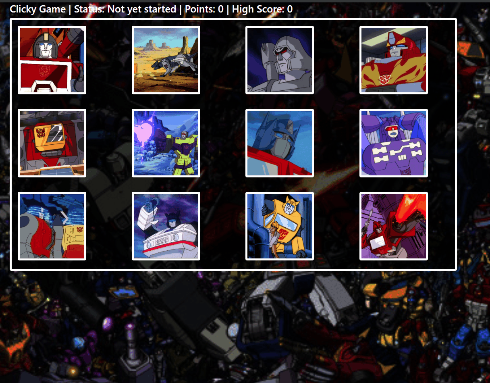

# Clicky Game

This is a clicky game application that tests your memory. This app demonstrates the use of React. This application uses states to manage the current score as well as different components to render the application.

*  Examples of Clicky Game:

## Usage

This project was completed using Javascript, React, and Node.js.

## Contributing
Pull requests are welcome. For major changes, please open an issue first to discuss what you would like to change.

## License

created by kima111